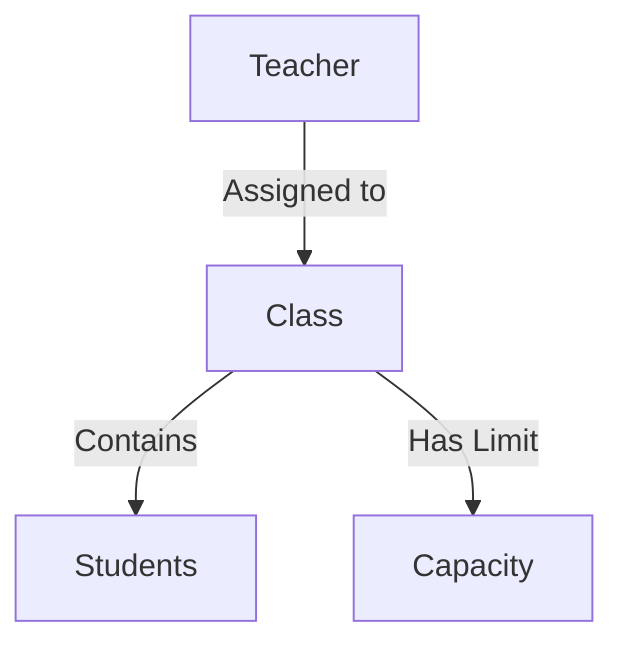

## Overview

The Class Management system enables administrators to create and maintain class groups, set capacity limits, and assign teachers to each class.

<CardGroup cols={2}>
  <Card title="Create Classes" icon="school">
    Set up new classes with capacity and teacher assignments
  </Card>
  <Card title="View Classes" icon="list-check">
    See all classes with their details and assignments
  </Card>
  <Card title="Update Classes" icon="pen-to-square">
    Modify class information and reassign teachers
  </Card>
  <Card title="Delete Classes" icon="trash">
    Remove classes that are no longer needed
  </Card>
</CardGroup>

## Adding a Class

Create new class groups with capacity limits and teacher assignments.

### Required Information

<AccordionGroup>
  <Accordion title="Class Name">
    The name or identifier for the class (text field, required)
    
    **Form Field:** `classYear`
    
    <Info>
      Examples:
      - Grade 1A
      - Year 7 Science
      - Advanced Mathematics
      - Physical Education 101
    </Info>
  </Accordion>
  
  <Accordion title="Class Capacity">
    Maximum number of students allowed in the class (number field, required)
    
    **Form Field:** `capacity`
    
    <Note>
      - Must be a positive number (minimum value: 1)
      - Consider classroom size and safety regulations
      - Default value field shows "capacity"
    </Note>
  </Accordion>
  
  <Accordion title="Teacher ID">
    The teacher assigned to this class (text field, required)
    
    **Form Field:** `Teacher_ID`
    
    <Warning>
      The teacher must exist in the system before being assigned to a class. Verify the Teacher ID from the Teacher Management system.
    </Warning>
  </Accordion>
</AccordionGroup>

### Database Operation

When creating a new class:

```php
INSERT INTO Class (classYear, capacity, Teacher_ID) 
VALUES ('$classYear', '$capacity', '$Teacher_ID')
```

<Note>
  **System Response:**
  - Success: "New record created successfully"
  - Error: "Error adding record"
</Note>

## Viewing Classes

Access a complete list of all classes with their details in table format.

### Display Columns

| Column | Description | Field Name |
|--------|-------------|------------|
| **Class ID** | Unique identifier (auto-generated) | Class_ID |
| **Class Name** | Name or identifier of the class | classYear |
| **Class Capacity** | Maximum student enrollment | capacity |
| **Teacher ID** | Assigned teacher reference | Teacher_ID |

### Database Query

```php
SELECT Class_ID, classYear, capacity, Teacher_ID 
FROM Class
```

The table displays all active classes with their current capacity settings and teacher assignments.

## Class Capacity Management

<Info>
  The capacity field helps ensure classes don't exceed safe or effective teaching limits.
</Info>

### Capacity Planning

<Steps>
  <Step title="Assess Classroom Size">
    Determine the physical space available for the class
  </Step>
  
  <Step title="Consider Teaching Effectiveness">
    Balance class size with quality of instruction
  </Step>
  
  <Step title="Set Capacity Limit">
    Enter the maximum number of students allowed
  </Step>
  
  <Step title="Monitor Enrollment">
    Track student assignments against capacity limits
  </Step>
</Steps>

<Warning>
  While the system allows you to set capacity, it does not automatically prevent student assignment beyond the limit. Monitor enrollments manually.
</Warning>

## Updating Class Information

Modify existing class details including name, capacity, and teacher assignment.

### Update Process

<Steps>
  <Step title="Identify the Class">
    Enter the Class ID to locate the record
  </Step>
  
  <Step title="Provide Updated Information">
    Modify any of the following:
    - Class name/identifier
    - Capacity limit
    - Assigned Teacher ID
  </Step>
  
  <Step title="Submit Changes">
    Save the updates to the database
  </Step>
</Steps>

### Database Operation

```php
UPDATE Class 
SET classYear = '$classYear', capacity = '$capacity', Teacher_ID = '$Teacher_ID' 
WHERE Class_ID = '$Class_ID'
```

<Info>
  When reassigning teachers, verify the new Teacher ID exists in the Teacher table.
</Info>

## Deleting a Class

Remove class records that are no longer needed.

### Deletion Process

1. Navigate to the **Delete Class** page
2. Enter the **Class ID** of the class to remove
3. Submit the deletion request

<Warning>
  **Before Deleting a Class:**
  - Check if any students are currently assigned to this Class_ID
  - Reassign students to other classes before deletion
  - Deletion is permanent and cannot be reversed
  - Verify you have the correct Class ID
</Warning>

### Database Operation

```php
DELETE FROM Class 
WHERE Class_ID = $Class_ID
```

<Note>
  **Response Messages:**
  - Success: "Record has been deleted."
  - Error: "Error deleting record."
</Note>

## Database Schema

The `Class` table structure:

```sql
Table: Class
- Class_ID (Primary Key, Auto-increment)
- classYear (VARCHAR)
- capacity (INT)
- Teacher_ID (Foreign Key → Teacher.Teacher_ID)
```

## Class-Teacher-Student Relationships

<Info>
  Classes serve as the central organizational unit connecting teachers and students.
</Info>

### Relationship Diagram



### Data Integrity

<AccordionGroup>
  <Accordion title="Teacher Assignment">
    Each class must have a valid Teacher_ID that exists in the Teacher table
  </Accordion>
  
  <Accordion title="Student Enrollment">
    Students reference Class_ID when enrolled in the system
  </Accordion>
  
  <Accordion title="Capacity Monitoring">
    Track the number of students assigned versus the capacity limit
  </Accordion>
</AccordionGroup>

## Best Practices

<CardGroup cols={2}>
  <Card title="Naming Conventions" icon="tag">
    Use consistent naming schemes for classes (e.g., Grade 1A, Year 7B)
  </Card>
  <Card title="Realistic Capacity" icon="users">
    Set capacity based on classroom size and educational standards
  </Card>
  <Card title="Teacher Verification" icon="user-check">
    Always verify Teacher ID exists before class creation
  </Card>
  <Card title="Student Check" icon="clipboard-list">
    Review student enrollments before deleting classes
  </Card>
</CardGroup>

## Planning Considerations

<Steps>
  <Step title="Determine Class Types">
    Identify subjects and grade levels needed
  </Step>
  
  <Step title="Calculate Capacity Needs">
    Based on expected enrollment and available space
  </Step>
  
  <Step title="Assign Qualified Teachers">
    Match teacher specializations with class requirements
  </Step>
  
  <Step title="Monitor and Adjust">
    Review capacity and assignments regularly
  </Step>
</Steps>

<Warning>
  Class records are referenced by Student records. Ensure all students are reassigned before deleting a class to maintain data integrity.
</Warning>
