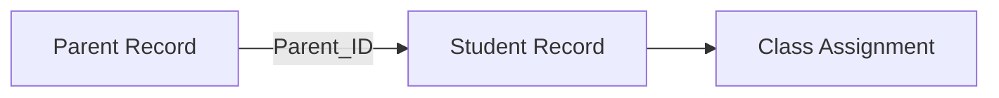

## Overview

The Parent Management system maintains contact information for student parents and guardians, enabling effective communication and maintaining family relationships with enrolled students.

<CardGroup cols={2}>
  <Card title="Add Parents" icon="users">
    Register parent/guardian information
  </Card>
  <Card title="View Records" icon="address-book">
    Access parent contact details in table format
  </Card>
  <Card title="Update Information" icon="user-edit">
    Modify existing parent records
  </Card>
  <Card title="Remove Parents" icon="user-slash">
    Delete parent records when necessary
  </Card>
</CardGroup>

## Adding a Parent

Register new parent or guardian information to associate with student records.

### Required Information

<AccordionGroup>
  <Accordion title="Parent First Name">
    The parent or guardian's first name (text field, required)
    
    **Form Field:** `Pname`
    
    Enter the legal first name of the parent or guardian
  </Accordion>
  
  <Accordion title="Parent Last Name">
    The parent or guardian's last name (text field, required)
    
    **Form Field:** `Psurname`
    
    Enter the legal last name of the parent or guardian
  </Accordion>
  
  <Accordion title="Parent Address">
    Complete residential address (textarea, 50 cols × 10 rows, required)
    
    **Form Field:** `Paddress`
    
    <Info>
      Provide the complete address including:
      - Street address
      - City
      - State/Province
      - Postal/ZIP code
      - Country (if applicable)
    </Info>
  </Accordion>
  
  <Accordion title="Parent Email">
    Email address for communication (email input, optional)
    
    **Form Field:** `Pemail`
    
    <Note>While optional, an email address is highly recommended for school communications</Note>
  </Accordion>
</AccordionGroup>

### Database Operation

When adding a new parent record:

```php
INSERT INTO Parent (Pname, Psurname, Paddress, Pemail) 
VALUES ('$pname', '$psurname', '$paddress', '$pemail')
```

<Note>
  **System Feedback:**
  - Success: "New record created successfully"
  - Error: "Error adding record"
</Note>

## Viewing Parent Records

Access all parent information in a comprehensive table view.

### Display Columns

| Column | Description | Field Name |
|--------|-------------|------------|
| **Parent ID** | Unique identifier (auto-generated) | Parent_ID |
| **Parent Name** | First name | Pname |
| **Parent Surname** | Last name | Psurname |
| **Parent Address** | Residential address | Paddress |
| **Parent Email** | Email address | Pemail |

### Database Query

The system retrieves parent records using:

```php
SELECT Parent_ID, Pname, Psurname, Paddress, Pemail 
FROM Parent
```

All parent records are displayed in an organized table format for easy access and reference.

## Updating Parent Information

Modify existing parent records to keep contact information current.

### Update Process

<Steps>
  <Step title="Locate Parent Record">
    Enter the Parent ID to identify which record to update
  </Step>
  
  <Step title="Enter Updated Information">
    Provide the new information:
    - Parent first name
    - Parent last name  
    - Updated address
    - Current email address
  </Step>
  
  <Step title="Save Changes">
    Submit the form to update the parent record in the database
  </Step>
</Steps>

### Database Operation

```php
UPDATE Parent 
SET Pname = '$Pname', Psurname = '$Psurname', Paddress = '$Paddress', Pemail = '$Pemail' 
WHERE Parent_ID = '$Parent_ID'
```

<Info>
  Keep parent information up-to-date to ensure effective communication regarding student progress and school events.
</Info>

## Deleting a Parent Record

Remove parent records that are no longer needed in the system.

### Deletion Process

1. Navigate to the **Delete Parent** page
2. Enter the **Parent ID** of the record to remove
3. Confirm and submit the deletion

<Warning>
  **Before Deleting:**
  - Verify no students are currently associated with this Parent ID
  - Deletion is permanent and cannot be undone
  - Ensure you have the correct Parent ID
</Warning>

### Database Operation

```php
DELETE FROM Parent 
WHERE Parent_ID = $Parent_ID
```

<Note>
  **Response Messages:**
  - Success: "Record has been deleted."
  - Error: "Error deleting record."
</Note>

## Database Schema

The `Parent` table structure:

```sql
Table: Parent
- Parent_ID (Primary Key, Auto-increment)
- Pname (VARCHAR)
- Psurname (VARCHAR)  
- Paddress (TEXT)
- Pemail (VARCHAR)
```

## Parent-Student Relationships

<Info>
  The Parent ID is used as a foreign key in the Student table, creating the relationship between parents and their children enrolled in the school.
</Info>

### Relationship Flow



<Steps>
  <Step title="Create Parent Record">
    Add the parent to the system first
  </Step>
  
  <Step title="Note the Parent ID">
    The system generates a unique Parent_ID automatically
  </Step>
  
  <Step title="Register Student">
    Use the Parent_ID when adding student records
  </Step>
</Steps>

## Communication Management

<CardGroup cols={2}>
  <Card title="Email Contact" icon="envelope">
    Maintain valid email addresses for digital communication
  </Card>
  <Card title="Address Records" icon="house">
    Keep physical addresses current for official mail
  </Card>
  <Card title="Multiple Children" icon="children">
    One parent record can be linked to multiple student records
  </Card>
  <Card title="Contact Verification" icon="circle-check">
    Regularly verify contact information accuracy
  </Card>
</CardGroup>

## Best Practices

<AccordionGroup>
  <Accordion title="Verify Contact Information">
    Always confirm email addresses and physical addresses at enrollment time
  </Accordion>
  
  <Accordion title="Update Regularly">
    Encourage parents to notify the school of any contact information changes
  </Accordion>
  
  <Accordion title="Check Dependencies">
    Before deleting a parent record, verify no students are currently linked to that Parent_ID
  </Accordion>
  
  <Accordion title="Maintain Privacy">
    Ensure parent contact information is handled according to privacy regulations
  </Accordion>
</AccordionGroup>

<Warning>
  Parent records are referenced by student records. Deleting a parent who has active students in the system may cause data integrity issues.
</Warning>
