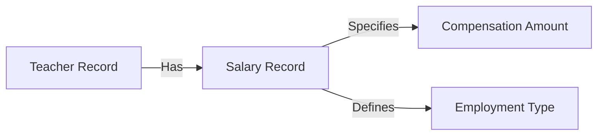

## Overview

The Salary Management system tracks teacher compensation information including salary amounts and working time classifications (part-time vs. full-time).

<CardGroup cols={2}>
  <Card title="Add Salary Records" icon="money-bill">
    Create new salary entries for teachers
  </Card>
  <Card title="View Salaries" icon="table">
    Access all salary records in table format
  </Card>
  <Card title="Update Salaries" icon="pen-to-square">
    Modify existing compensation information
  </Card>
  <Card title="Remove Records" icon="trash">
    Delete salary records when necessary
  </Card>
</CardGroup>

## Adding a Salary Record

Create salary records for teachers specifying their compensation and employment type.

### Required Information

<AccordionGroup>
  <Accordion title="Teacher ID">
    Reference to the teacher receiving compensation (text field, required)
    
    **Form Field:** `Teacher_ID`
    
    <Warning>
      The teacher must exist in the Teacher Management system before creating a salary record. Verify the Teacher ID first.
    </Warning>
  </Accordion>
  
  <Accordion title="Salary Amount">
    Compensation amount for the teacher (text field, required)
    
    **Form Field:** `salary_amount`
    
    <Info>
      Enter the salary amount according to your organization's compensation structure:
      - Annual salary
      - Monthly salary
      - Per-period amount
      
      Ensure consistency across all salary records
    </Info>
  </Accordion>
  
  <Accordion title="Working Type">
    Employment classification (dropdown, required)
    
    **Form Field:** `workingTimes`
    
    <Tabs>
      <Tab title="Part-Time">
        **Value:** `partTime`
        
        For teachers working:
        - Less than full-time hours
        - Specific days per week
        - Limited class schedules
      </Tab>
      
      <Tab title="Full-Time">
        **Value:** `fullTime`
        
        For teachers working:
        - Standard full-time hours
        - Complete weekly schedules
        - Full academic year contracts
      </Tab>
    </Tabs>
  </Accordion>
</AccordionGroup>

### Database Operation

When adding a new salary record:

```php
INSERT INTO Salary (Teacher_ID, salary_amount, workingTimes) 
VALUES ('$Teacher_ID', '$salary_amount', '$workingTimes')
```

<Note>
  **System Response:**
  - Success: "New record created successfully"
  - Error: "Error adding record"
</Note>

## Viewing Salary Records

Access all teacher compensation information in a comprehensive table.

### Display Columns

| Column | Description | Field Name |
|--------|-------------|------------|
| **Salary_ID** | Unique salary record identifier | Salary_ID |
| **Teacher_ID** | Associated teacher reference | Teacher_ID |
| **Salary Amount** | Compensation amount | salary_amount |
| **Working Times** | Employment type (Part-Time/Full-Time) | workingTimes |

### Database Query

```php
SELECT Salary_ID, Teacher_ID, salary_amount, workingTimes 
FROM Salary
```

All salary records are displayed in an organized table for easy reference and payroll processing.

## Employment Types

<CardGroup cols={2}>
  <Card title="Part-Time" icon="clock">
    ### Part-Time Employment
    
    **Value:** `partTime`
    
    Characteristics:
    - Reduced working hours
    - Flexible schedules
    - Proportional compensation
    - Specific course assignments
  </Card>
  
  <Card title="Full-Time" icon="calendar-days">
    ### Full-Time Employment
    
    **Value:** `fullTime`
    
    Characteristics:
    - Standard working hours
    - Full course load
    - Complete benefits package
    - Year-round contracts
  </Card>
</CardGroup>

## Salary Record Management

### Creating Salary Records

<Steps>
  <Step title="Verify Teacher">
    Confirm the teacher exists in the system using Teacher Management
  </Step>
  
  <Step title="Determine Amount">
    Calculate appropriate compensation based on:
    - Teaching experience
    - Qualifications
    - Subject specialization
    - Employment type
  </Step>
  
  <Step title="Select Working Type">
    Choose between Part-Time or Full-Time classification
  </Step>
  
  <Step title="Create Record">
    Submit the form to create the salary entry
  </Step>
</Steps>

<Info>
  Each teacher can have one salary record. If compensation changes, update the existing record rather than creating a new one.
</Info>

## Updating Salary Records

Modify existing salary information for teachers.

### Update Process

<Steps>
  <Step title="Locate Record">
    Enter the Salary ID to identify which record to update
  </Step>
  
  <Step title="Provide New Information">
    Update any of the following:
    - Teacher ID (if reassigning record)
    - Salary amount (for raises, adjustments)
    - Working type (if employment status changes)
  </Step>
  
  <Step title="Save Changes">
    Submit to update the salary record
  </Step>
</Steps>

### Common Update Scenarios

<AccordionGroup>
  <Accordion title="Salary Increase">
    When giving raises:
    1. Locate the teacher's salary record
    2. Enter the new salary amount
    3. Keep working type the same
    4. Submit the update
  </Accordion>
  
  <Accordion title="Employment Type Change">
    When converting from part-time to full-time (or vice versa):
    1. Find the salary record
    2. Adjust the salary amount appropriately
    3. Change the working type selection
    4. Save the changes
  </Accordion>
  
  <Accordion title="Salary Adjustment">
    For periodic adjustments:
    1. Review current salary amount
    2. Calculate new amount based on policy
    3. Update the salary_amount field
    4. Confirm and submit
  </Accordion>
</AccordionGroup>

### Database Operation

```php
UPDATE Salary 
SET Teacher_ID = '$Teacher_ID', salary_amount = '$salary_amount', workingTimes = '$workingTimes' 
WHERE Salary_ID = '$Salary_ID'
```

## Deleting Salary Records

Remove salary records that are no longer needed.

### Deletion Process

1. Navigate to **Delete Salary** page
2. Enter the **Salary ID**
3. Confirm and submit deletion

<Warning>
  **Before Deleting:**
  - Verify this is the correct record to remove
  - Consider archiving instead of deleting for historical records
  - Ensure payroll processing for this teacher is complete
  - Deletion is permanent and cannot be undone
</Warning>

### Database Operation

```php
DELETE FROM Salary 
WHERE Salary_ID = $Salary_ID
```

<Note>
  **Response Messages:**
  - Success: "Record has been deleted."
  - Error: "Error deleting record."
</Note>

## Database Schema

The `Salary` table structure:

```sql
Table: Salary
- Salary_ID (Primary Key, Auto-increment)
- Teacher_ID (Foreign Key → Teacher.Teacher_ID)
- salary_amount (DECIMAL or VARCHAR)
- workingTimes (ENUM or VARCHAR: partTime, fullTime)
```

## Teacher-Salary Relationship

<Info>
  Salary records are linked to teacher records via Teacher_ID, creating a relationship between teacher profiles and their compensation.
</Info>

### Relationship Diagram



### Data Integrity Considerations

<AccordionGroup>
  <Accordion title="Teacher Verification">
    Always verify the Teacher_ID exists before creating a salary record
  </Accordion>
  
  <Accordion title="One Record Per Teacher">
    Each teacher should have only one active salary record
  </Accordion>
  
  <Accordion title="Consistent Formatting">
    Maintain consistent salary amount formatting across all records
  </Accordion>
  
  <Accordion title="Working Type Accuracy">
    Ensure working type matches actual employment contracts
  </Accordion>
</AccordionGroup>

## Payroll Processing

<Steps>
  <Step title="Review Records">
    Access all salary records from the View Salaries page
  </Step>
  
  <Step title="Calculate by Type">
    Process full-time and part-time salaries according to pay schedules
  </Step>
  
  <Step title="Include Bonuses">
    Reference bonus_amount from Teacher records for additional compensation
  </Step>
  
  <Step title="Generate Reports">
    Export salary information for payroll systems
  </Step>
</Steps>

## Best Practices

<CardGroup cols={2}>
  <Card title="Regular Reviews" icon="calendar-check">
    Schedule periodic reviews of salary records for accuracy
  </Card>
  <Card title="Consistent Amounts" icon="equals">
    Use consistent formatting for salary amounts (annual, monthly, etc.)
  </Card>
  <Card title="Document Changes" icon="file-pen">
    Keep records of salary adjustments and reasons
  </Card>
  <Card title="Verify References" icon="link">
    Ensure Teacher_ID is valid before creating records
  </Card>
</CardGroup>

## Compensation Structure Tips

<Info>
  When setting up your salary management system, consider:
</Info>

<AccordionGroup>
  <Accordion title="Salary Scales">
    Establish clear salary scales based on:
    - Years of experience
    - Educational qualifications
    - Subject specializations
    - Employment type (full-time vs. part-time)
  </Accordion>
  
  <Accordion title="Bonus Integration">
    Coordinate with bonus_amount field in Teacher records:
    - Base salary in Salary table
    - Performance bonuses in Teacher table
    - Total compensation = base + bonus
  </Accordion>
  
  <Accordion title="Privacy Considerations">
    Protect salary information:
    - Limit access to authorized personnel
    - Follow privacy regulations
    - Secure payroll data
  </Accordion>
  
  <Accordion title="Update Procedures">
    Create processes for:
    - Annual raises
    - Merit increases
    - Employment type changes
    - New hire compensation
  </Accordion>
</AccordionGroup>

<Warning>
  Salary records are tied to teacher records via Teacher_ID. Before deleting a teacher record, ensure their salary information is properly archived or transferred.
</Warning>
